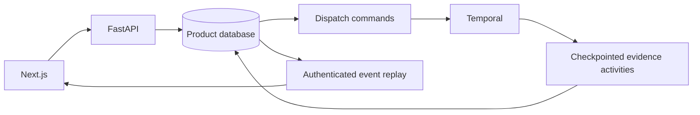

# Architecture

Next.js proxies `/api` to FastAPI. Python owns typed contracts, authorization, persistence, and workflow state. PostgreSQL is the intended deployment store; SQLite supports local development and integration tests.

## Durable execution

Starting a mission atomically persists its queued state and outbox command. The dispatcher uses stable workflow IDs and rejects duplicate starts, including after completion. Each explicit retry has a new run number; completed activity outputs remain reusable checkpoints. Cancellation sets product state first, preventing late activity writes, and queues cancellation to Temporal.

Activity state, output, and ordered events commit together. Event sequence allocation locks the mission. SSE replays stored events using Last-Event-ID; local polling wakes the stream every 500 ms. Redis publication is not wired yet. The frontend deduplicates sequences and reconnects, including after terminal runs so other tabs can discover manual retries.

## Analysis and artifacts

Fixture matching uses exact skills attached to candidate evidence. Eligibility evaluates supplied bounds, location, authorization alternatives, and dates; missing hard-requirement coverage remains unknown. No cutoff is inferred from a role title and remote preference does not imply on-site eligibility.

Generation reads completed extraction, matching, and verification checkpoints. Four reviewable drafts quote stored evidence and cite job/candidate sources. Completion atomically stores artifact IDs, report, pipeline update, and final events. Artifact versions are uniquely indexed. A workspace lock serializes pipeline upserts for concurrent missions targeting the same workspace and job; other workspaces have distinct opportunities.

Generated drafts are version 1 and are not sent or submitted. Revision editing, diffs, LLM drafting, and durable approval waits remain pending. Approval REST endpoints currently resolve stored rows only.

## Sessions and migrations

Random bearer tokens are hashed at rest. Guest sessions expire after 24 hours; reset rotates the token in the same workspace. It is not a destructive workspace-data reset. The API applies configurable hashed-identity limits per process to general requests, guest-session issuance, and mission mutations. Account authentication, shared multi-replica limiting, and public-deployment hardening remain pending.

Six ordered migrations define foundation tables, dispatch/checkpoint storage, pipeline/approvals, artifacts, workspace profiles/documents, and imported job snapshots. They run transactionally; PostgreSQL uses an advisory lock. Migration 003 inspects existing columns before adding them, avoiding transaction-aborting duplicate-column errors on bootstrapped databases. Migration 004 works with SQLite and PostgreSQL syntax; only SQLite runtime is currently verified.

Workspace profile updates use optimistic versions and immutable evidence. Plain-text ingestion deduplicates checksums and records line/character provenance. Planning snapshots both profile and job to keep retries stable after corrections or new imports.

Public ingestion uses static JobPosting JSON-LD, with raw HTML snapshots and explicit requirement excerpts. HTTPS transport rejects private/reserved DNS answers, pins the selected public IP with hostname-verified TLS, and revalidates redirects. Limits cover response bytes, redirect count, socket timeouts and a retrieval deadline; OS DNS resolution is not independently bounded. Imported requirements default to required and need review. Browser screenshots, semantic matching, and inferred hard constraints are pending.
