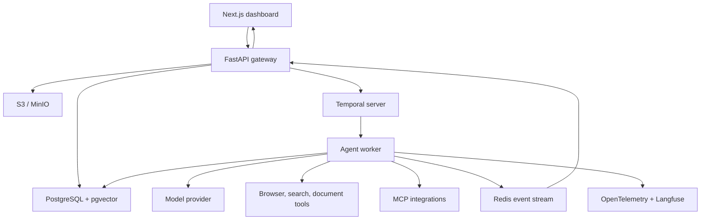
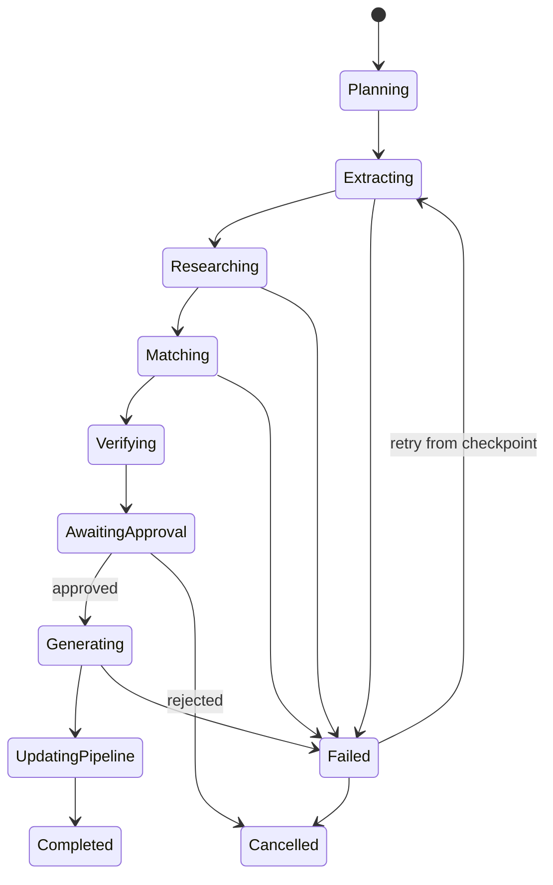

# Operator: Personal Work Execution Agent

## Implementation Plan and Technical Blueprint

**Primary showcase workflow:** Opportunity Intelligence and Application Management  
**Target outcome:** A recruiter can open a guest workspace, launch a mission, watch it execute live, inspect evidence and tool calls, approve a proposed action, simulate a failure, and view the final measurable result.

---

## 1. Product definition

Operator converts a high-level goal into a durable, observable workflow that can research information, reason over personal context, create artifacts, request approval, perform controlled actions, and preserve an audit trail.

The first complete vertical is the **Opportunity Agent**:

> Given a job URL and a candidate profile, research the role and company, determine fit using verifiable evidence, produce an application pack, request approval for external actions, and update the application pipeline.

This vertical is narrow enough to finish but exercises the same platform capabilities needed for future personal workflows.

### Success criteria

The project is complete only when a new visitor can:

1. Enter or select a job URL.
2. Launch a mission without configuring private integrations.
3. Watch real workflow steps update in the dashboard.
4. Inspect sources, tool arguments, structured outputs, latency, and cost.
5. Approve, edit, or reject a proposed action.
6. See the resulting application and artifacts in the pipeline.
7. Retry a failed step without duplicating completed work.
8. Open the evaluation page and see measured performance on a test set.

---

## 2. Scope boundaries

### Build in version 1

- Resume/profile ingestion
- Public job-page extraction
- Requirement extraction into a typed schema
- Company and role research with citations
- Candidate-to-job evidence matching
- Explainable fit score
- Tailored resume suggestions and cover letter
- Persistent missions and step states
- Live workflow visualization
- Approval gates
- Application pipeline
- Run trace, cost, latency, and error inspection
- Guest demo workspace with synthetic data
- Evaluation dataset and regression dashboard
- MCP server exposing safe read and mission operations

### Defer until the core is excellent

- Automatic job submission
- Full Gmail inbox access
- LinkedIn automation
- General-purpose visual workflow builder
- Arbitrary code execution
- Mobile application
- Voice interface
- More than one polished workflow vertical
- Multiple agents conversing without a measurable reason

### Explicitly prohibited in version 1

- Irreversible external actions without user approval
- Passing OAuth tokens or secrets into model context
- Treating webpage text as trusted instructions
- Claiming a fact without storing its source

---

## 3. Recommended technology stack

| Area | Technology | Responsibility |
|---|---|---|
| Monorepo | pnpm workspaces + Turborepo | Web packages and shared schemas |
| Frontend | Next.js 15, TypeScript | Dashboard, pipeline, run inspector, guest demo |
| UI | Tailwind CSS, shadcn/ui, React Flow | Product UI and live workflow graph |
| Data fetching | TanStack Query | Server state, caching, invalidation |
| API | FastAPI, Python 3.12, Pydantic | Product API, streaming, auth enforcement |
| Agent runtime | OpenAI Agents SDK | Model calls, tools, guardrails, structured outputs |
| Durable orchestration | Temporal Python SDK | Long-running workflows, retries, approval waits, recovery |
| Primary database | PostgreSQL 16 | Users, missions, applications, approvals, audit data |
| Semantic retrieval | pgvector | Evidence and profile retrieval |
| Cache/live events | Redis | SSE fan-out, short-lived cache, rate limiting |
| Browser tool | Playwright | Job-page extraction and evidence screenshots |
| Object storage | MinIO locally; S3/R2 in production | Resumes, screenshots, generated artifacts |
| Observability | OpenTelemetry + Langfuse | End-to-end traces, model spans, prompt versions |
| Authentication | Auth.js | Accounts and sessions |
| Protocol | MCP Python SDK | Expose missions and pipeline to compatible clients |
| Testing | Pytest, Vitest, Playwright E2E | Unit, integration, workflow, and UI testing |
| Local environment | Docker Compose | Postgres, Redis, Temporal, MinIO, Langfuse |
| CI/CD | GitHub Actions | Lint, tests, migrations, build, deployment checks |

### Why this separation works

- **Temporal** controls workflow order, durable waiting, timeouts, retries, and recovery.
- **Agents SDK** controls LLM reasoning, structured responses, tool calls, and guardrails.
- **PostgreSQL** is the authoritative business-data store.
- **Redis** is not authoritative; it is used only for live delivery, rate limits, and cache.
- **pgvector** supports semantic lookup, while hard constraints remain normal typed columns.

Do not add LangGraph to this stack initially. It overlaps with orchestration already handled by Temporal and the Agents SDK.

---

## 4. High-level architecture



### Request lifecycle

1. Web client creates a mission through FastAPI.
2. API validates permissions, stores the mission, and starts a Temporal workflow.
3. Temporal schedules bounded activities such as extraction, matching, and generation.
4. Agent worker performs model and tool operations and records step events.
5. Events are stored in PostgreSQL and published through Redis.
6. FastAPI streams events to the dashboard using Server-Sent Events.
7. A risky activity creates an approval and the workflow waits durably.
8. User approves, edits, or rejects through the API.
9. Temporal resumes from the same point.
10. Artifacts and final metrics become available in the mission report.

---

## 5. Core workflow

### Opportunity mission states



### Workflow activities

1. **Plan mission**
   - Validate goal and budget.
   - Produce a typed execution plan.
   - Choose only registered tools.

2. **Extract job**
   - Fetch the URL.
   - Capture page metadata and screenshot.
   - Extract requirements into a strict schema.
   - Store source excerpts with offsets and URLs.

3. **Load candidate evidence**
   - Retrieve structured profile constraints.
   - Retrieve relevant resume/project evidence.
   - Preserve artifact and chunk provenance.

4. **Research company**
   - Gather official company/product/career information.
   - Store citations and retrieval timestamps.

5. **Match and score**
   - Map every requirement to supporting or missing evidence.
   - Calculate hard-constraint eligibility in deterministic code.
   - Use an LLM only for semantic matching and explanation.

6. **Verify**
   - Reject unsupported claims.
   - Check that each positive match has candidate evidence.
   - Check that each company claim has a source.

7. **Request approval**
   - Show proposed artifacts and pipeline changes.
   - Allow the user to edit arguments before approval.

8. **Generate application pack**
   - Resume change suggestions, never invented achievements.
   - Cover letter.
   - Interview preparation brief.
   - Deadline and follow-up proposal.

9. **Commit results**
   - Update application pipeline idempotently.
   - Store artifacts, audit records, and outcome metrics.

---

## 6. Data model

### Essential tables

| Table | Important fields |
|---|---|
| `users` | id, name, email, created_at |
| `workspaces` | id, owner_id, name, is_demo |
| `profiles` | workspace_id, education, availability, locations, preferences |
| `documents` | id, workspace_id, type, object_key, checksum, version |
| `evidence_chunks` | id, document_id, text, embedding, metadata, source_location |
| `companies` | id, name, website, normalized_domain |
| `opportunities` | id, company_id, title, URL, location, employment_type, deadline |
| `job_requirements` | id, opportunity_id, category, text, importance, source_id |
| `applications` | id, opportunity_id, workspace_id, stage, fit_score, next_action |
| `missions` | id, workspace_id, type, goal, status, budget, temporal_workflow_id |
| `mission_steps` | id, mission_id, name, status, attempt, started_at, completed_at |
| `events` | id, mission_id, step_id, sequence, type, payload, created_at |
| `tool_calls` | id, step_id, tool_name, redacted_input, output_ref, status, latency_ms |
| `sources` | id, URL, title, excerpt, retrieved_at, content_hash |
| `claims` | id, mission_id, text, confidence, verification_status |
| `claim_sources` | claim_id, source_id |
| `approvals` | id, mission_id, action_type, proposed_payload, status, resolved_by |
| `artifacts` | id, mission_id, type, object_key, version, status |
| `model_calls` | id, step_id, model, prompt_version, tokens, cost, latency_ms |
| `audit_logs` | id, workspace_id, actor_type, actor_id, action, entity, before, after |
| `eval_cases` | id, dataset_version, input, expected_output, tags |
| `eval_runs` | id, dataset_version, prompt_version, model, metrics, created_at |

### Important modeling rules

- Use JSONB for flexible event payloads, not core relational fields.
- Put deadlines, locations, stages, permissions, and statuses in typed columns.
- Store embeddings only for text that benefits from semantic retrieval.
- Every generated artifact is versioned.
- Every side effect has an idempotency key.
- Every event receives a monotonic sequence number per mission.

---

## 7. API surface

### Mission APIs

- `POST /v1/missions`
- `GET /v1/missions/{mission_id}`
- `GET /v1/missions/{mission_id}/events`
- `GET /v1/missions/{mission_id}/stream`
- `POST /v1/missions/{mission_id}/cancel`
- `POST /v1/missions/{mission_id}/retry`
- `POST /v1/missions/{mission_id}/simulate-failure`

### Approval APIs

- `GET /v1/approvals`
- `POST /v1/approvals/{approval_id}/approve`
- `POST /v1/approvals/{approval_id}/reject`
- `PATCH /v1/approvals/{approval_id}/proposal`

### Profile and evidence APIs

- `POST /v1/profile/documents`
- `GET /v1/profile`
- `PATCH /v1/profile`
- `GET /v1/evidence`
- `DELETE /v1/evidence/{evidence_id}`

### Opportunity APIs

- `POST /v1/opportunities/import`
- `GET /v1/opportunities`
- `GET /v1/opportunities/{opportunity_id}`
- `PATCH /v1/applications/{application_id}`
- `GET /v1/applications/{application_id}/history`

### Evaluation APIs

- `POST /v1/evals/runs`
- `GET /v1/evals/runs`
- `GET /v1/evals/runs/{eval_run_id}`
- `GET /v1/evals/compare?baseline=...&candidate=...`

---

## 8. Repository structure

```text
operator/
├── apps/
│   ├── web/                    # Next.js dashboard
│   └── api/                    # FastAPI gateway
├── services/
│   ├── agent-worker/           # Agents SDK tools and policies
│   ├── workflow-worker/        # Temporal workflows and activities
│   └── mcp-server/             # Operator MCP server
├── packages/
│   ├── ui/                     # Shared UI components
│   ├── contracts/              # JSON Schema/OpenAPI generated types
│   └── config/                 # Shared lint and build configuration
├── evals/
│   ├── datasets/
│   ├── graders/
│   └── reports/
├── infra/
│   ├── docker/
│   ├── migrations/
│   ├── telemetry/
│   └── deployment/
├── tests/
│   ├── integration/
│   ├── workflow/
│   └── e2e/
├── docs/
│   ├── architecture.md
│   ├── threat-model.md
│   ├── evaluation.md
│   └── demo-script.md
└── docker-compose.yml
```

---

## 9. Phased build plan

The estimates assume approximately 15–20 focused hours per week. Working full-time can roughly halve the calendar duration, but the exit criteria should not be skipped.

## Phase 0 — Product specification and design

**Duration:** 2–3 days  
**Goal:** Freeze the first demo before writing infrastructure.

### Tasks

- Write three exact user stories.
- Define the Opportunity Mission input and output schemas.
- Create low-fidelity wireframes for:
  - Mission Control
  - New Mission
  - Live Run Inspector
  - Opportunity Detail
  - Approval Inbox
  - Evaluation Lab
- Define mission and step state machines.
- Define the fit-scoring rubric.
- Prepare one synthetic candidate and three sample jobs.
- Write the three-minute recruiter demo script.
- Record non-goals and safety boundaries.

### Exit criteria

- Every screen supports a step in the demo.
- Mission input/output schemas are versioned.
- No core requirement depends on a private account.
- A diagram explains which decisions are deterministic and which use an LLM.

---

## Phase 1 — Repository and product foundation

**Duration:** 4–5 days  
**Goal:** A deployable shell with authentication and persistent product data.

### Backend tasks

- Create monorepo and CI.
- Configure Docker Compose.
- Add PostgreSQL, Redis, Temporal, MinIO, and Langfuse locally.
- Create initial database migrations.
- Add FastAPI health, auth, workspace, and mission endpoints.
- Generate TypeScript types from OpenAPI.
- Add structured logging and request IDs.

### Frontend tasks

- Implement design tokens and responsive application shell.
- Add sidebar, command bar, status components, and empty states.
- Create mocked versions of all six main screens.
- Add Auth.js and workspace selection.
- Add guest-demo entry point.

### Quality tasks

- Linting, formatting, type checks, and unit-test jobs.
- Seed script for demo data.
- Initial README with one-command local startup.

### Exit criteria

- `docker compose up` launches all local dependencies.
- A user can sign in, open a workspace, and create a persisted draft mission.
- CI passes on a clean checkout.
- Guest workspace is resettable.

---

## Phase 2 — First end-to-end agent workflow

**Duration:** 7–9 days  
**Goal:** One job URL travels through a real durable workflow and produces a stored report.

### Tasks

- Implement Temporal `OpportunityMissionWorkflow`.
- Implement bounded activities:
  - `extract_job_page`
  - `parse_job_requirements`
  - `load_candidate_profile`
  - `match_candidate_evidence`
  - `verify_claims`
  - `generate_report`
- Define Pydantic schemas for all activity inputs and outputs.
- Implement Playwright extraction with a static-HTML fallback.
- Store raw source snapshots and screenshots.
- Implement the first Agents SDK tools.
- Add hard limits for tool calls, tokens, duration, and cost.
- Store model/tool usage per step.
- Implement retry policies and non-retryable error types.
- Add idempotency keys for all writes.

### Test cases

- Valid job page
- Page unavailable
- JavaScript-rendered page
- Missing deadline
- Job conflicting with graduation year
- Requirement with no candidate evidence
- Tool timeout followed by successful retry

### Exit criteria

- A real public job page produces typed requirements and an evidence-backed match report.
- Workflow survives worker restart.
- Re-running a completed activity does not create duplicate application data.
- Unsupported profile claims are absent from the final output.

---

## Phase 3 — Real-time Mission Control dashboard

**Duration:** 5–7 days  
**Goal:** Make execution understandable and interactive.

### Tasks

- Define the canonical event envelope.
- Persist every workflow event before publishing it.
- Publish live events through Redis.
- Implement SSE endpoint with last-event replay.
- Build React Flow mission graph.
- Build step inspector with tabs:
  - Summary
  - Evidence
  - Tool calls
  - Model usage
  - Errors and retries
- Add pause, cancel, retry, and resume controls.
- Add streaming progress text based on real events.
- Add reconnect handling and event deduplication.
- Build mission summary cards for cost, latency, sources, and completion.

### Exit criteria

- Two browser tabs show consistent mission state.
- Refreshing the page reconstructs the complete workflow from stored events.
- A disconnected client can resume from its last event ID.
- The UI never invents a “thinking” state; every visual state maps to a stored event.

---

## Phase 4 — Complete Opportunity Intelligence product

**Duration:** 7–9 days  
**Goal:** Turn the workflow engine into something genuinely useful daily.

### Tasks

- Implement resume/profile ingestion.
- Extract structured education, skills, experience, projects, dates, and preferences.
- Add profile correction UI.
- Chunk and embed evidence with provenance.
- Implement deterministic eligibility checks:
  - Graduation year
  - Location
  - Work authorization
  - Internship dates
  - Experience bounds
- Implement requirement-to-evidence matrix.
- Create transparent weighted fit score.
- Add application pipeline and stage history.
- Generate versioned artifacts:
  - Resume change set
  - Cover letter
  - Recruiter/referral message
  - Interview preparation brief
- Add artifact diff view.
- Add citation viewer and browser screenshot preview.

### Exit criteria

- Every match links to candidate evidence.
- Every external fact links to a retrieved source.
- The score can be reproduced from stored inputs and rubric.
- No generated resume bullet introduces an unverified metric.
- An application appears in the pipeline with complete history.

---

## Phase 5 — Approvals, integrations, and MCP

**Duration:** 6–8 days  
**Goal:** Safely let Operator act rather than only recommend.

### Tasks

- Implement durable Temporal signals for approvals.
- Build Approval Inbox.
- Allow edit-before-approve.
- Add approval expiration and cancellation.
- Add low-, medium-, and high-risk action classification.
- Implement calendar event creation in a development/mock connector first.
- Implement email draft creation; do not send automatically.
- Encrypt integration credentials at rest.
- Add per-tool OAuth scopes and revocation.
- Build MCP server tools:
  - `create_mission`
  - `get_mission_status`
  - `list_pending_approvals`
  - `resolve_approval`
  - `search_opportunities`
  - `get_application_pipeline`
- Add resource endpoints for mission reports and artifacts.
- Ensure the same authorization policy is used by REST and MCP.

### Exit criteria

- Workflow can wait indefinitely for approval without holding a web process.
- Edited approval arguments are schema-validated.
- Repeated approval requests cannot perform an action twice.
- Revoking an integration blocks future calls immediately.
- MCP and web clients display the same mission state.

---

## Phase 6 — Security and reliability hardening

**Duration:** 5–7 days  
**Goal:** Demonstrate production judgment under failure and hostile input.

### Tasks

- Write a threat model.
- Treat browser content as untrusted data.
- Add prompt-injection classifiers and deterministic content boundaries.
- Add tool allowlists and URL/domain restrictions.
- Prevent local/private-network requests from the browser tool.
- Redact PII and secrets from traces.
- Add workspace-level authorization tests.
- Add API and mission rate limits.
- Add circuit breakers and provider timeouts.
- Add dead-letter handling for exhausted activities.
- Add model fallback policy.
- Add mission budgets and loop limits.
- Implement failure simulation for browser, model, database, and integration errors.
- Add backup and migration rollback documentation.

### Exit criteria

- A malicious job description cannot invoke tools or alter system policy.
- Cross-workspace data-access tests fail closed.
- Secrets do not appear in model input, logs, traces, or UI.
- Failure simulation visibly retries or stops according to policy.
- Recovery does not duplicate completed side effects.

---

## Phase 7 — Evaluation and observability

**Duration:** 5–7 days  
**Goal:** Prove quality rather than describing it.

### Evaluation dataset

Create at least 40 cases across:

- Straightforward eligible roles
- Clearly ineligible roles
- Ambiguous graduation requirements
- Missing location information
- Misleading job titles
- Conflicting requirements
- Weak candidate evidence
- Prompt injection inside job pages
- Partial page extraction
- Duplicate opportunities

### Graders

- Schema validity: deterministic
- Eligibility accuracy: deterministic
- Requirement extraction precision/recall: deterministic
- Citation coverage: deterministic
- Citation entailment: model grader plus manual sample
- Unsupported candidate claims: deterministic/model hybrid
- Ranking quality: pairwise model grader plus human labels
- Artifact usefulness: human rubric
- Tool success rate: telemetry
- Cost and latency: telemetry

### Dashboard tasks

- Compare prompt and model versions.
- Show regressions by category.
- Link failed evals to complete traces.
- Add P50/P95 latency.
- Add cost per successful mission.
- Add success rate by tool and workflow step.
- Add weekly quality trend.

### Exit criteria

- A prompt or model change cannot be promoted without an eval result.
- Dashboard compares a candidate version with a stored baseline.
- At least ten cases have manually verified labels.
- README reports real measured metrics, not estimates.

---

## Phase 8 — Deployment and recruiter polish

**Duration:** 5–7 days  
**Goal:** Make the project immediately understandable and dependable during evaluation.

### Deployment tasks

- Create staging and production configurations.
- Deploy web, API, and workers.
- Use managed Postgres and object storage.
- Configure HTTPS, domains, health checks, backups, and alerts.
- Add database migration job.
- Add provider outage fallback message.
- Add daily reset for the public demo workspace.

### Demo tasks

- Create one excellent seeded mission.
- Add “Try demo” without signup.
- Add guided three-step onboarding.
- Add architecture and security pages.
- Add a 90-second demo video/GIF.
- Add a public status/limitations section.
- Provide sample MCP configuration.
- Write architecture decision records for five important tradeoffs.
- Add screenshots, measured metrics, and demo credentials to README.

### Final demo sequence

1. Open guest workspace.
2. Paste/select a job.
3. Launch mission.
4. Inspect live research and evidence nodes.
5. Open a tool call and source screenshot.
6. Simulate a transient failure.
7. Show retry and checkpoint recovery.
8. Edit and approve a proposed pipeline action.
9. Open generated application artifacts.
10. Show the completed application and evaluation score.

### Exit criteria

- A visitor reaches the first useful result in under three minutes.
- Demo works on a fresh incognito session.
- No private credentials or personal data are required.
- Mobile layout is usable even if desktop remains the primary experience.
- Repository can be started locally from documented commands.

---

## 10. Suggested calendar

| Week | Main target | Demonstrable outcome |
|---|---|---|
| 1 | Phase 0–1 | Navigable product shell and persistent draft mission |
| 2 | Phase 2 | Job URL produces a real structured match report |
| 3 | Phase 3 | Workflow executes live on Mission Control |
| 4 | Phase 4 | Complete profile-to-application vertical |
| 5 | Phase 5 | Approval-controlled action and MCP access |
| 6 | Phase 6 | Failure recovery and security demonstration |
| 7 | Phase 7 | Evaluation and observability dashboards |
| 8 | Phase 8 | Public recruiter-ready deployment |

Add a ninth week as contingency. If behind, cut integrations and voice features—not tests, guest mode, provenance, or evaluation.

---

## 11. Build priority

### P0 — Required for portfolio release

- Job ingestion
- Candidate profile/evidence
- Durable mission workflow
- Live run inspector
- Fit analysis with citations
- Approval gate
- Application pipeline
- Guest demo
- Basic evaluations
- Public deployment

### P1 — Strong differentiators

- Failure simulator
- MCP server
- Artifact version diff
- Prompt/model comparison
- Calendar and email-draft connectors
- Full cost and latency observability

### P2 — Only after release

- Scheduled job discovery
- Voice mission input
- Additional workflow templates
- Team workspaces
- Custom workflow builder
- Local model support

---

## 12. Testing strategy

### Unit tests

- Fit-score calculation
- Eligibility rules
- Schema validation
- Permission policies
- Redaction
- Idempotency key generation
- Event ordering

### Integration tests

- Database and object storage
- Temporal workflow and activities
- Approval signal/resume
- Redis publish/replay
- Browser extraction
- MCP authorization

### Contract tests

- FastAPI OpenAPI against generated TypeScript client
- Tool input/output schemas
- Model structured-output schemas
- MCP tool schemas

### End-to-end tests

- Guest launches mission and receives live events
- User approves an action and workflow resumes
- Browser activity fails once and recovers
- Page refresh reconstructs the run
- Completed mission creates exactly one application
- Unauthorized workspace access is rejected

### Evaluation tests

- Run the small critical set on every pull request.
- Run the complete set before deployment.
- Store model, prompt, dataset, and code versions with every result.

---

## 13. Key engineering decisions to document

Create short architecture decision records for:

1. Temporal instead of an in-process job queue.
2. Agents SDK instead of several agent frameworks.
3. SSE instead of WebSockets for primarily server-to-client events.
4. PostgreSQL plus pgvector instead of a separate vector database.
5. Human approval for side effects.
6. Event persistence before live publication.
7. Deterministic eligibility rules plus LLM semantic matching.
8. Guest synthetic workspace instead of requiring recruiter integrations.

---

## 14. Metrics to publish

Do not invent numbers. Populate these after running evaluations:

- Requirement extraction precision and recall
- Eligibility classification accuracy
- Citation coverage and correctness
- Unsupported-claim rate
- Tool-call success rate
- Workflow completion rate
- Recovery rate after transient failure
- P50/P95 end-to-end latency
- Median cost per completed mission
- Human approval/edit/rejection rate
- Application artifact usefulness score

---

## 15. Definition of done

Operator is recruiter-ready when:

- The public demo performs a real workflow.
- Workflow state is durable across process restarts.
- Every important claim is traceable to evidence.
- External actions require explicit approval.
- The UI reveals actual execution rather than decorative agent activity.
- Errors are understandable and safely recoverable.
- Evaluations quantify system quality.
- The repository includes tests, architecture, threat model, and deployment instructions.
- A recruiter can understand the product and its engineering depth within five minutes.

---

## 16. Immediate first sprint backlog

Start with these tickets in this order:

1. Write versioned `MissionInput`, `JobPosting`, `CandidateProfile`, `RequirementMatch`, and `MissionResult` schemas.
2. Create the monorepo and Docker Compose dependencies.
3. Create initial migrations for workspaces, missions, steps, events, opportunities, and applications.
4. Seed one synthetic candidate and three job pages/snapshots.
5. Build the static Mission Control and Run Inspector screens.
6. Implement `POST /v1/missions` and `GET /v1/missions/{id}`.
7. Start the Temporal workflow with mocked activities.
8. Replace the extraction mock with Playwright.
9. Replace the matching mock with a structured Agents SDK call.
10. Store and render the first real workflow result.

The first major milestone is not “all infrastructure configured.” It is:

> A recruiter clicks one button, watches a real job-analysis workflow complete, and can inspect why it reached its result.
